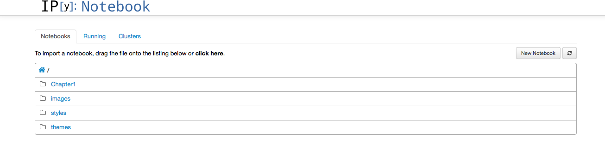

Python for year 1 Geographers
=============================

As an experiment this year (2014/15), my first year (Geography BA/BSc) tutees are learning to program in python.

These notes will provide backup material for what we have covered. They can also be used as a 'self learning' resource for other students. 

I encourage any (UCL) students who have difficulties with what we are doing to see me in my office hours or [email me](http:www2.geog.ucl.ac.uk/~plewis).

Resources
=========

Download a python distribution
------------------------------

Assuming you have a laptop or other computer of your own, you can download and install a python distribution for free. This will put all of the things you need to use the programming language on your (local) comnputer. If you do not have your own machine, you can access python from computers at UCL.

[Python](https://www.python.org/) is a very useful, powerful and easy to learn  programming language. If you are able to learn how to write code, you will no longer be limited by what is on offer on your computer / the internet, but you can design and build your own programs to do what you want to do. This is a very empowering concept.

To make teaching of a course like this more straightforward, I reccomend that you install the [Anaconda python](http://continuum.io/downloads "downloads") distribution. This should work directly from the installers [provided](http://continuum.io/downloads "downloads").

Run an ipython notebook
------------------------

In these classes, we will be using [ipython notebooks](http://ipython.org/notebook.html). This is a useful and powerful tool for doing your work in, and also for sharing what you have done. You will find [many examples of interesting notebooks](https://github.com/ipython/ipython/wiki/A-gallery-of-interesting-IPython-Notebooks "interesting notebooks") on the web.

You should be able to easily get started by launching a notebook (theer should be a direct link to 'launch ipython notebook' or similar from where your [Anaconda python](http://continuum.io/downloads "downloads") has been installed on your computer. 

If you have this running, you should see a window opened in a browser with something like:

